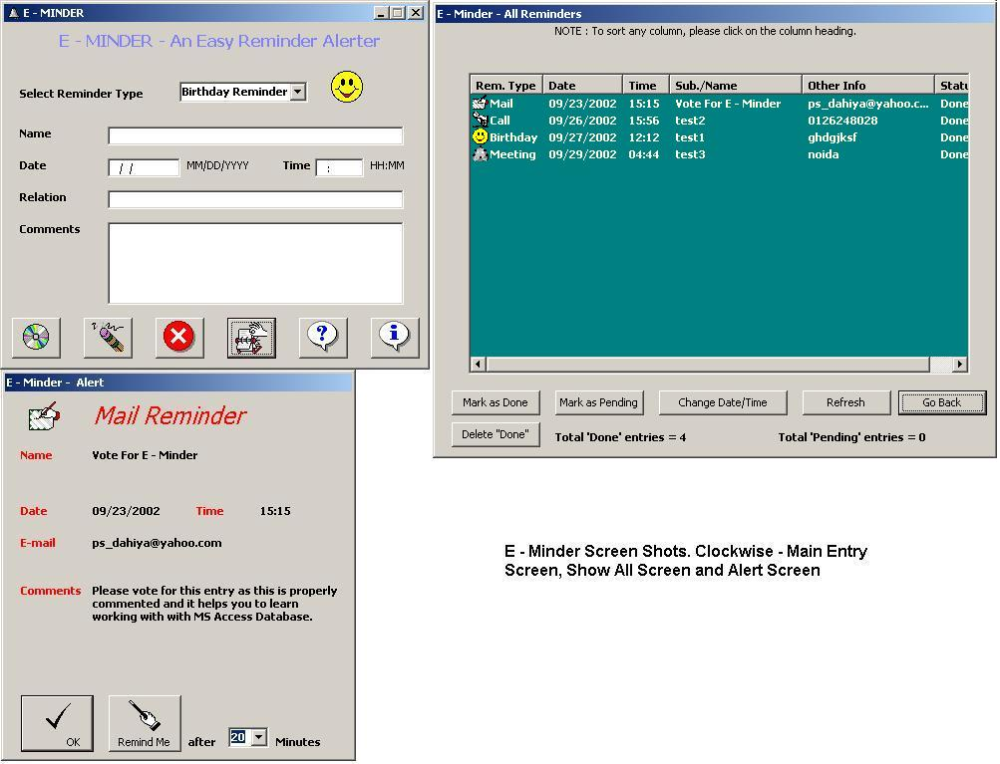



## A 0 E \- Minder \- A Reminder Alerter

### Description

Cant remember the important things in your busy schedule? Then have this code (Using MS Access Database). This code reminds you on the date and time set by you by a popup window which will be on top of all running applications. Prpoerly commented. You can reschedule the reminders. Can mark them as pending a or done. At start up checks all the reminders which are not shown previously bcoz this application was not running at that time.when you close it (by X) then it will be in the system tray.Dont forget to vote for me.
 
### More Info
 

             |
---                |---
**Submitted On**   |2002-09-23 17:43:08
**By**             |[Parmender Dahiya](https://github.com/Planet-Source-Code/PSCIndex/blob/master/ByAuthor/parmender-dahiya.md)
**Level**          |Intermediate
**User Rating**    |4.6 (158 globes from 34 users)
**Compatibility**  |VB 6\.0
**Category**       |[Databases/ Data Access/ DAO/ ADO](https://github.com/Planet-Source-Code/PSCIndex/blob/master/ByCategory/databases-data-access-dao-ado__1-6.md)
**World**          |[Visual Basic](https://github.com/Planet-Source-Code/PSCIndex/blob/master/ByWorld/visual-basic.md)
**Archive File**   |[A\_0\_E\_\-\_Mi1359399252002\.zip](https://github.com/Planet-Source-Code/parmender-dahiya-a-0-e-minder-a-reminder-alerter__1-39204/archive/master.zip)

### API Declarations

In the program

